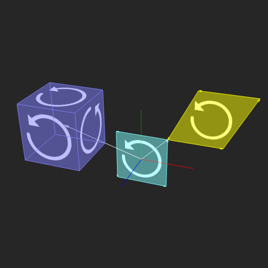

## Mathplay project

 **by sunny.P**
 Mathematical code that allow you to visualize (Vanila) Geometric Algebra ,Written in Kotlin by |Noobs| so plz don't kill me if I code anything stupid (tho, plz feel free to point them out)
 this project used kool-engine https://github.com/kool-engine/kool so if you interested; consider check it too!

**Syntax**
start define your Multivector using

    val a = Multivector(s=1.0,x=1.0,y=1.0,z=1.0,xy=1.0,yz=1.0,zx=.10,xyz=1.0)
Then you could start doing operation by

    a+b
    a-b
    a*b
    a*s //s is Double
    a/s
    a.outer(b)
    a.inner(b) // use Hestenes's inner product
    a.leftCon(b)
    a.rightCon(b)

**Visualize**
Inside Stage.kt  find 

    ctx.scenes += scene {  
      defaultOrbitCamera()  
      defaultStage(this)
      //write all visualize code here
    }
use these function to display desired object

    a.drawVector(this,zero,Color.LIGHT_GRAY) //zero is built-in multivector, use as "base" to put object
    a.biFromVector(this,b,zero, Color.CYAN)
    a.trivectorDraw(this)

